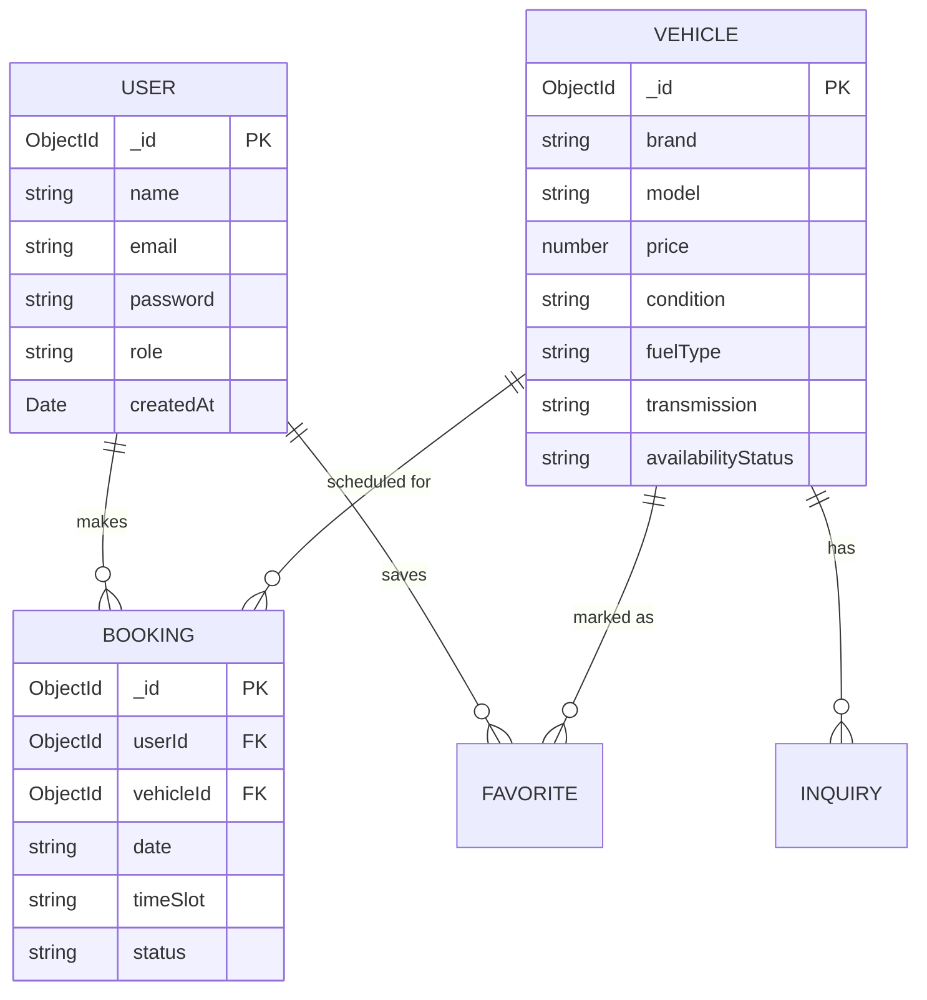

# Design and Implementation of a Smart Car Dealership Management and Customer Booking System

## Final Year Computer Science Project

Welcome to the complete source code for the **Smart Car Dealership Management and Customer Booking System**. This system is a modern, responsive, and robust full-stack web application designed to help car dealerships manage vehicle inventory, customer inquiries, and test-drive bookings.

---

## 1. Installation Guide

This project is built to run effortlessly out-of-the-box. It includes a custom **JSON File-Based Fallback Engine** that will automatically take over if a local MongoDB server is not running, ensuring perfect evaluation without complicated database setups.

### Prerequisites
- Node.js (v16+ recommended)
- npm or npx

### Setup the Backend
1. Open a terminal and navigate to the `backend` folder.
2. Run `npm install` to install dependencies.
3. (Optional) Create a `.env` file and set `MONGODB_URI`. If omitted, the system falls back to the JSON Mock DB.
4. Run `node seed.js` to populate the database with initial vehicles and an admin account.
5. Run `npm start` (or `npm run dev`) to start the server on `http://localhost:5000`.

### Setup the Frontend
1. Open a new terminal and navigate to the `frontend` folder.
2. Run `npm install` to install dependencies.
3. Run `npm run dev` to start the React application.
4. Visit `http://localhost:5173` in your browser.

### Default Credentials
- **Admin**: `admin@automajid.com` / `admin123`

---

## 2. System Architecture Diagram

```mermaid
graph TD
    Client[Client Browser (React.js, Tailwind CSS)]
    API[Backend API (Node.js, Express.js)]
    DBProxy[Database Proxy Wrapper]
    Mongo[(MongoDB via Mongoose)]
    JSON[(JSON Fallback Storage)]

    Client -->|HTTP GET/POST/PUT/DELETE| API
    API -->|JWT Authentication| API
    API --> DBProxy
    DBProxy -- If MONGODB_URI resolves --> Mongo
    DBProxy -- If Connection Fails --> JSON
```

---

## 3. ER Diagram (Entity Relationship)



---

## 4. Use Case Diagram

```mermaid
usecaseDiagram
    actor Customer
    actor Admin

    package "Dealership System" {
        usecase "Browse Inventory" as UC1
        usecase "Search & Filter Cars" as UC2
        usecase "Book Test Drive" as UC3
        usecase "Manage Inventory" as UC4
        usecase "Approve Bookings" as UC5
        usecase "View Analytics" as UC6
    }

    Customer --> UC1
    Customer --> UC2
    Customer --> UC3

    Admin --> UC4
    Admin --> UC5
    Admin --> UC6
```

---

## 5. Database Schema

- **Users**: `_id`, `name`, `email`, `password`, `role` (customer, admin), `createdAt`
- **Vehicles**: `_id`, `brand`, `model`, `year`, `price`, `mileage`, `fuelType`, `transmission`, `engineSize`, `color`, `condition` (New/Used), `description`, `availabilityStatus` (Available/Sold), `images` (array of URLs/paths), `createdAt`
- **Bookings**: `_id`, `userId`, `vehicleId`, `date`, `timeSlot`, `status` (Pending/Approved/Rejected), `notes`, `createdAt`
- **Inquiries**: `_id`, `vehicleId` (optional), `name`, `email`, `phone`, `message`, `status` (Read/Unread), `createdAt`
- **Favorites**: `_id`, `userId`, `vehicleId`, `createdAt`

---

## 6. API Documentation

### Auth Routes
- `POST /api/auth/register` - Register a new customer
- `POST /api/auth/login` - Authenticate user & get JWT token
- `GET /api/auth/profile` - Get logged-in user profile (Private)

### Vehicle Routes
- `GET /api/vehicles` - Get all cars (Supports query params: brand, condition, minPrice, maxPrice, search)
- `GET /api/vehicles/:id` - Get car details
- `POST /api/vehicles` - Add new car (Admin only)
- `PUT /api/vehicles/:id` - Update car (Admin only)
- `DELETE /api/vehicles/:id` - Delete car (Admin only)

### Booking Routes
- `POST /api/bookings` - Submit a test drive booking (Private)
- `GET /api/bookings/my-bookings` - Get current user bookings (Private)
- `GET /api/bookings` - Get all bookings (Admin only)
- `PUT /api/bookings/:id` - Approve/Reject booking status (Admin only)

---

## 7. User Manual

### For Customers:
1. **Homepage**: Start by clicking "Browse Inventory".
2. **Inventory**: Use the top filters (Make, Condition, Max Price) to filter vehicles.
3. **Registration**: Click "Sign up" in the top right to create an account.
4. **Booking**: Once logged in, click "View Details" on a car, and submit a test drive booking date.

### For Admins:
1. **Login**: Go to the login page and enter the admin credentials (`admin@automajid.com`).
2. **Dashboard**: Navigate to `/admin` to view overall statistics.
3. **Manage Inventory**: Use the CRUD features to add new vehicles, update prices, or mark cars as "Sold".
4. **Manage Bookings**: View pending test drives and change their status to "Approved" or "Rejected".

---
*Developed for academic evaluation. Features a responsive luxury design, complete testing mocks, and seamless JSON database fallback.*
